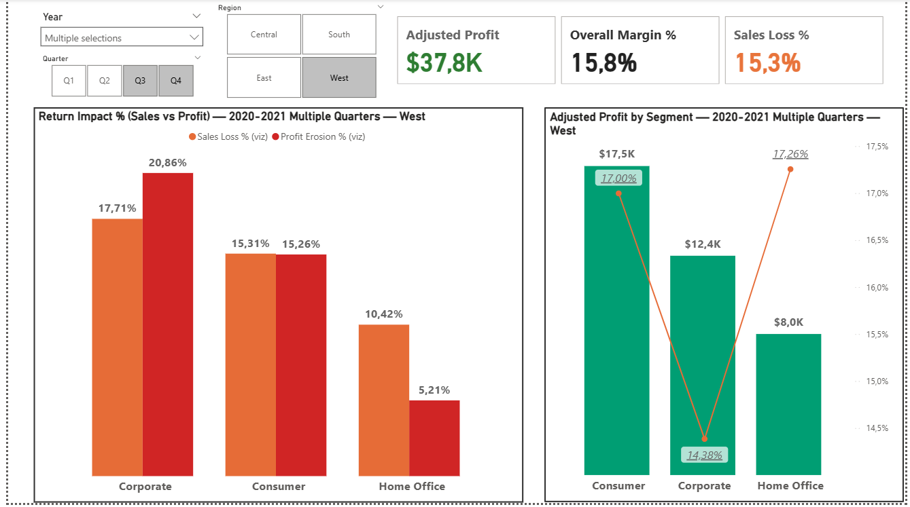

# Profit & Returns Performance Dashboard (Power BI)

**Purpose:** pinpoint where profit is created and where margin is eroded by returns—so actions are targeted.

**Highlights**
- **Model:** clean star schema (FactOrders, Returns, DimDate ✓ marked, DimProduct, DimState, DimSegment)
- **Measures:** Adjusted Profit/Sales, Returned Profit/Sales, **Adjusted Margin %**, **Return Impact %**  
  → *Sales Returned % (viz)* and *Profit Erosion % (viz)* (0–100%, magnitude, no negative confusion)
- **Slicers:** **Year → Quarter** (multi-select enabled) and **Region**
- **Dynamic titles:** adapt to single year/quarter, ranges, or multiple selections; region aware
- **Drill path:** Segment → Category → **Sub-Category (Top-5 / Bottom-3)**
- **UX:** combo charts (**Profit bars + Margin % line**), focused Sub-Category tooltip (Profit, Sales, Margin %, Return Impact %)
- **Clarity aids:** “Show items with no data” on dimension axes + subtitle that lists items at **0%** (so empty bars are explained)

---

## Model (Star Schema)

---

## Screenshots
**Segment overview**  

**Category breakdown**  

**Sub-Category drilldown (Top-5 / Bottom-3 + Margin % line + tooltip)**  

**Tooltip example (hover on a Sub-Category)**  

---

## Key findings (at default filters shown)
- **Profit concentration:** Top-5 Sub-Categories (e.g., Accessories, Binders, Paper, Phones, Chairs) drive a disproportionate share of **Adjusted Profit** with healthy **Margin %**.  
- **Loss pockets:** Bottom-3 (e.g., Tables, Supplies, Bookcases) show thin/negative profit; **Profit Erosion %** highlights return-driven margin loss.  
- **Segment pattern:** Consumer often carries higher return impact; Corporate steadier; Home Office varies by region/quarter.  
- **Zero-return slices exist:** certain Region×Quarter combos legitimately show **0%** (subtitle lists them so empty bars aren’t confusing).  
- **Actionability:** combine **Margin % line** with **Return Impact %** to separate pricing/mix opportunities from returns/process issues.

> Findings adapt with slicers (Year → Quarter, Region). The dashboard is built for scenario analysis, not a single static answer.

---

## How to use
1. Set **Year/Quarter** and **Region** (multi-select is enabled; titles update to reflect ranges or “Multiple”).
2. Scan **Segment → Category → Sub-Category**.
3. On Sub-Category, focus on **Bottom-3**; hover bars for tooltip drivers.
4. Read **Margin % line** + **Return Impact %** to separate mix/pricing from returns pressure.

---

## Getting started
- Open `report/Profit-Returns-Dashboard.pbix` in Power BI Desktop  
  _or_ open `report/Profit-Returns-Dashboard.pbit` and point to your (demo) data.

---

## Data
- **Source:** public demo dataset (e.g., *Sample Superstore*) for portfolio/educational use. Rights remain with the original provider.  
- **Repro options:**  
  - Use the `.pbit` template and connect to the official dataset download.  
  - (Optional) include a small sample CSV in `data/sample/`; Power Query in the template splits it into `FactOrders`, `Returns`, and `People`.

---

## Repository
- `report/` – PBIX (report) and/or PBIT (template)  
- `docs/gif/` – walkthrough GIF  
- `docs/screenshots/` – page & tooltip screenshots  
- `docs/model/` – star-schema image  
- `dax/Measures.md` – key DAX

*Demo/sanitized data for portfolio purposes. License: MIT.*