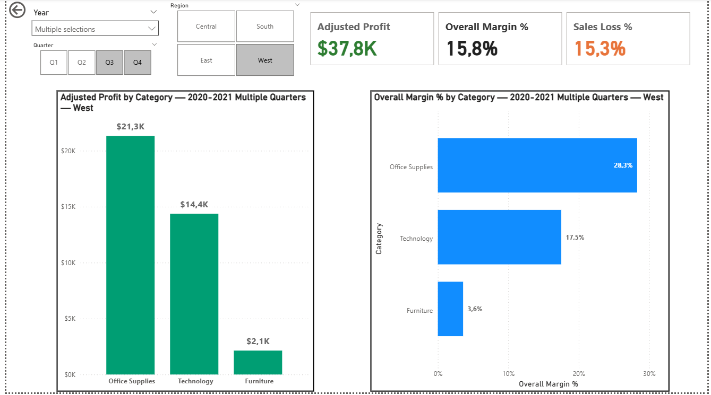

# Profit & Returns Performance Dashboard (Power BI)

**Purpose.** Identify where the business is **winning** and where margin is **eroded by returns** so leaders know **where to intervene**.

- **Model:** clean star schema (FactOrders, Returns, DimDate ✓ marked, DimProduct, DimState, DimSegment)
- **Measures:** Adjusted Sales/Profit, Returned Sales/Profit, **Adjusted Margin %**, **Sales/Profit Loss %**
- **Slicers:** Year → Quarter, Region
- **Drill path:** Segment → Category → **Sub-Category (Top-5 / Bottom-3)**
- **UX:** dynamic titles, combo charts (Profit + Margin % line), and a focused sub-category tooltip (Profit, Sales, Margin %, Loss %)

---

## Screenshots

**Segment overview**  

**Category breakdown**  

**Sub-Category drilldown (Top-5 / Bottom-3 with Margin % line + tooltip)**  

> Tip: if images don’t load, ensure they’re saved at `docs/screenshots/segment.png`, `category.png`, `subcategory.png`.

---

## Executive highlights (default filters shown in screenshots)

- **Where we win (Top-5 Sub-Categories):** e.g., *Accessories, Binders, Paper, Phones, Chairs* drive the bulk of **Adjusted Profit** with **healthy margins**.  
- **Where we leak (Bottom-3):** e.g., *Tables, Supplies, Bookcases* show **negative or thin profit**. Margin % line makes the efficiency gap obvious.
- **Returns pressure:** higher **Sales Loss %** aligns with lower margins in the laggards—clear targets for policy/process fixes.
- **Actionability:** Use **Year/Quarter** and **Region** slicers to localize the plan (pricing, returns policy, vendor quality, ops).

---

## How to use

1. Open the `.pbix` (or the `.pbit` template) in Power BI Desktop.  
2. Set **Year/Quarter** and **Region** from the slicers.  
3. Scan **KPIs** (Adjusted Profit, Margin %, Sales Loss %).  
4. Walk **Segment → Category → Sub-Category**.  
5. On Sub-Category, focus on **Bottom-3**; hover bars for the **tooltip** drivers.

---

## Repository contents

- `report/` – Power BI report/template  
- `docs/screenshots/` – the images above  
- `dax/Measures.md` – key DAX (Adjusted Profit, Margin %, Loss %, Top-5/Bottom-3 flags, dynamic titles)

*Data is demo/sanitized for portfolio use. License: MIT.*
