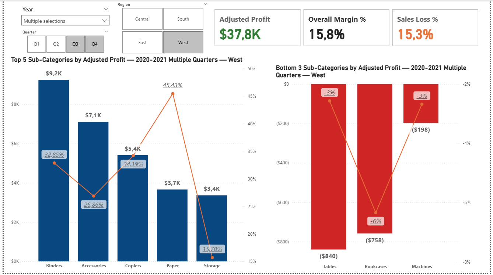

# Profit & Returns Performance Dashboard (Power BI)

**Goal:** identify where the business is winning and where margin is leaking due to returns, so we know where to intervene.

## What’s inside
- **Pages:** Segment Overview → Category Breakdown → Sub-Category (Top 5 / Bottom 3)
- **Slicers:** Year → Quarter, Region
- **Key measures:** Adjusted Profit, Adjusted Margin %, Sales Loss %, Profit Loss %

## How to view
- Open `report/Profit-Returns-Dashboard.pbix` in Power BI Desktop  
  _or_ open the `.pbit` template and point it to the sample data you use.

## Screenshots
Segment  

Category  

Sub-Category  

## Notes
- Demo/sanitized data for portfolio purposes.
- Model: Star schema with DimDate (marked), DimProduct, DimState, DimSegment.
- License: MIT.
